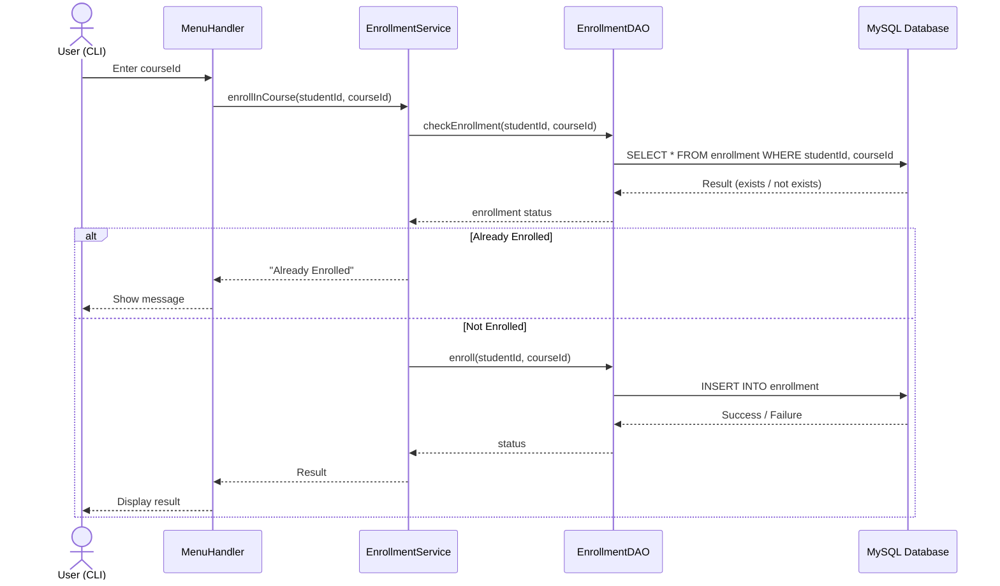

# INTISG26JFAGN001_Team-01_Training_Management_System_CLI_Repo


A robust, layered Java console application designed to manage students, trainers, courses, and certifications. This project demonstrates the implementation of CRUD operations, JDBC connectivity, and Layered Architecture (DAO/Service).


## Project Overview
The Training Management System provides a platform where:
- Trainers can manage course offerings and view student details.
- Students can browse available courses, enroll, and view their earned certifications.
- Data Integrity is maintained using a MySQL backend with soft-delete capabilities.


## Tech Stack
* Language Java 25
* Database MySQL 8.0
* Build Tool: Maven
* Connectivity: JDBC (Java Database Connectivity)
* Architecture: Layered Pattern (UI -> Service -> DAO -> Database)


## Main Features

### User Management
* Dual Role Login: Separate dashboards for Students and Trainers.
* Secure Registration: Prevents duplicate emails/usernames using custom `UserAlreadyExistsException`.
* Soft Delete: Records are flagged as deleted rather than removed from the database to maintain audit trails.

### Course & Enrollment
* Course Discovery: Students can browse a real-time list of courses created by trainers.
* One-Click Enrollment: Students can join courses; the system prevents double-enrollment in the same course.
* Trainer Insights: Trainers can see a list of all registered students.

### Certification
* Digital Certificates: Automatic generation of unique Certificate IDs (UUID) upon course completion.
* Verification: Students can view their history of certifications in their dashboard.


## Project Structure
```text
com.cognizant
├── config       # Database connection logic
├── dao          # Data Access Object interfaces
├── daoimpl      # JDBC implementations of DAOs
├── model        # POJO classes (Student, Course, etc.)
├── service      # Business logic and validation
├── exception    # Custom exception classes
└── ui           # MenuHandler and CLI logic
```

## Sequence Diagram

